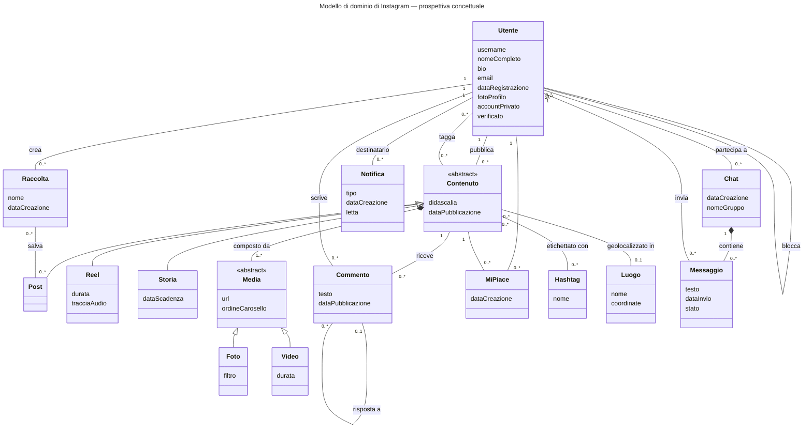

```mermaid
---
title: Modello di dominio di Instagram — prospettiva concettuale
---
classDiagram
    direction TB

    class Utente {
        username
        nomeCompleto
        bio
        email
        dataRegistrazione
        fotoProfilo
        accountPrivato
        verificato
    }

    class Contenuto {
        <<abstract>>
        didascalia
        dataPubblicazione
    }
    class Post
    class Reel {
        durata
        tracciaAudio
    }
    class Storia {
        dataScadenza
    }

    class Media {
        <<abstract>>
        url
        ordineCarosello
    }
    class Foto {
        filtro
    }
    class Video {
        durata
    }

    class Commento {
        testo
        dataPubblicazione
    }

    class MiPiace {
        dataCreazione
    }

    class Hashtag {
        nome
    }

    class Luogo {
        nome
        coordinate
    }

    class Chat {
        dataCreazione
        nomeGruppo
    }
    class Messaggio {
        testo
        dataInvio
        stato
    }

    class Notifica {
        tipo
        dataCreazione
        letta
    }

    class Raccolta {
        nome
        dataCreazione
    }

    %% Gerarchie di generalizzazione
    Contenuto <|-- Post
    Contenuto <|-- Reel
    Contenuto <|-- Storia
    Media <|-- Foto
    Media <|-- Video

    %% Utente e relazioni riflessive
    Utente "1" -- "0..*" Contenuto : pubblica
    Utente "0..*" -- "0..*" Utente : segue
    Utente "0..*" -- "0..*" Utente : blocca

    %% Composizione dei contenuti
    Contenuto "1" *-- "1..*" Media : composto da

    %% Commenti (con risposta annidata)
    Contenuto "1" -- "0..*" Commento : riceve
    Utente "1" -- "0..*" Commento : scrive
    Commento "0..1" -- "0..*" Commento : risposta a

    %% MiPiace come classe di associazione
    Utente "1" -- "0..*" MiPiace
    Contenuto "1" -- "0..*" MiPiace

    %% Metadati dei contenuti
    Contenuto "0..*" -- "0..*" Hashtag : etichettato con
    Contenuto "0..*" -- "0..1" Luogo : geolocalizzato in
    Contenuto "0..*" -- "0..*" Utente : tagga

    %% Messaggistica diretta
    Utente "2..*" -- "0..*" Chat : partecipa a
    Chat "1" *-- "0..*" Messaggio : contiene
    Utente "1" -- "0..*" Messaggio : invia

    %% Notifiche
    Utente "1" -- "0..*" Notifica : destinatario

    %% Raccolte/salvataggi
    Utente "1" -- "0..*" Raccolta : crea
    Raccolta "0..*" -- "0..*" Post : salva
```